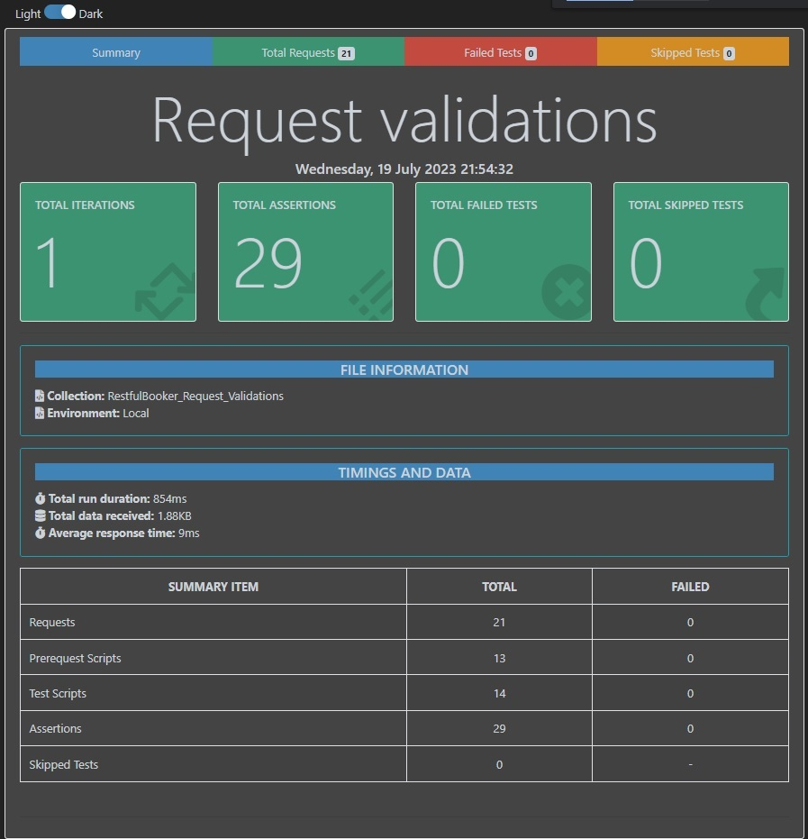

# Postman Restful Booker Demo

Esta es una pequeña demo de la [API Restful Booker](https://restful-booker.herokuapp.com/) ejecutando las colecciones de [Postman](https://www.postman.com/) con [Newman](https://github.com/postmanlabs/newman).
La API también se puede ejecutar localmente => [API Restful-booker](https://github.com/mwinteringham/restful-booker).


# Estructura del proyecto

 -[collections](collections) - Carpeta con la colección "RestfulBooker_CRUD_HappyPath.postman_collection.json" y "RestfulBooker_Request_Validations.postman_collection.json".
 
 -[environments](environments) - Contiene las variables para los entornos producción y local.
 
 -[reports](reports) - Dejé un par de ejemplos de reportes que se pueden general con Newman Reporter en formato .html.
 
 -[scripts_local](scripts_local) - Scripts para ejecutar las colecciones del ambiente local en Windows y Linux.
 
 -[scripts_production](scripts_production) - Scripts para ejecutar las colecciones del ambiente productivo en Windows y Linux.

## Instalaciones a realizar

- Instalar [Postman](https://www.postman.com/).
- Opcional: instalar la API localmente (lo recomiendo para hacer pruebas de manera tranquila). Se descarga o se clona el proyecto desde [aquí](https://github.com/mwinteringham/restful-booker). Yo utilizo [Visual Studio Code](https://code.visualstudio.com/download). Una vez descargado el proyecto, abrir una terminal y ejecutar los siguientes comandos para levantar la API en la ruta: [http://localhost:3001](http://localhost:3001/)

```
$ npm install
```

```
$ npm start
```

- Instalar [Newman](https://github.com/postmanlabs/newman)

```
$ npm install -g newman
```

- Instalar el [reporte de Newman](https://github.com/DannyDainton/newman-reporter-htmlextra).

```
$ npm install -g newman-reporter-htmlextra
```

## Explicación de los tests

La colección "RestfulBooker_CRUD_HappyPath" contiene los endpoints para ejecutarse en orden simulando un camino feliz. Se colocaron algunos tests de validaciones. En variables locales solo se guarda la url base. Luego las credenciales y token en las variables de la colección pero con el delete se limpian.
Postman incorpora la biblioteca faker.js con el cual se pueden generar todo tipo de datos random utilizados en el Post, Patch y Put.
El Patch, Put y Delete requieren el token en sus headers.

La colección "RestfulBooker_Request_Validations" (no sabía qué otro nombre ponerle) es mi favorita. Ya que cada endpoint se ejecuta de manera independiente.

--POST: no necesita el token en el header. Una vez que se ejecuta y se crea el booking, se ejecuta en los tests el Get y el Delete.

--PATCH/PUT: en el pre-req se llama al Post para generar el token y el Post para crear el booking, se envía en el Patch los datos a modificar, se llama al Get y luego al Delete para eliminar el booking.

--DELETE: se llama antes el Post para generar el token y el Post para crear el booking, se ejecuta el Delete y luego se valida la correcta eliminación con el Get pasándole el bookingid.

## Comandos para ejecutar las colecciones con Newman

Ubicados en la carpeta que contiene las colecciones y ambientes. Agregándole "-r htmlextra" se genera una carpeta "newman" donde se guardará el reporte .html.
```
$ newman run RestfulBooker_CRUD_HappyPath.postman_collection.json -e Local.postman_environment.json -r htmlextra
```

